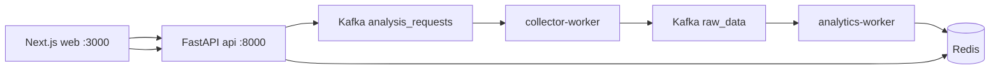

# Дипломний проєкт: виявлення дезінформації в соціальних мережах

Прототип **інформаційної системи** для збору публічних даних, аналізу коментарів і оцінки ризику дезінформації / неавтентичної поведінки. Веб-інтерфейс, мікросервісна черга (**Kafka**), кеш результатів (**Redis**), швидкий скоринг (**Random Forest**, Tier 1) і семантичний аналіз (**LLM**, Tier 2).

**Дипломна тема:** інформаційна система виявлення джерел розповсюдження дезінформації та неавтентичної поведінки чатботів.

---

## Швидкий старт

```bash
git clone https://github.com/slav41k/diploma.git
cd diploma
cp .env.example .env
docker compose up -d --build
```

Відкрийте **http://localhost:3000**

Без API-ключів можна одразу перевірити **«Новинний портал»** (парсинг статті за URL) або **mock-збір** для Twitter / Reddit / Instagram / Facebook. Детальна інструкція для викладача — у файлі [**РОЗГОРТАННЯ.md**](РОЗГОРТАННЯ.md).

| Сервіс | URL |
|--------|-----|
| Веб-інтерфейс | http://localhost:3000 |
| API (Swagger) | http://localhost:8000/docs |
| Health check | http://localhost:8000/health |

---

## Архітектура



**Потік даних:** користувач запускає аналіз у UI → API ставить задачу в Kafka → **collector** збирає дані (Telegram / новини / mock) → **analytics** застосовує RF, чорний список, тригер-фрази та LLM → результат у Redis → UI отримує його за `job_id`.

---

## Можливості

- **Збір:** Telegram (Telethon), новинні статті (newspaper3k), демо-режим для інших платформ
- **Tier 1:** Random Forest на ознаках тексту та метаданих; чорний список; категорії тригер-фраз
- **Tier 2:** LLM (Groq / Gemini / OpenAI) — рівень загрози та пояснення
- **UI:** вердикти 🟢 / 🟡 / 🔴, вік акаунта (MVP), причини спрацювання правил

---

## Стек технологій

| Шар | Технології |
|-----|------------|
| Frontend | Next.js, TypeScript, Tailwind CSS |
| Backend | FastAPI, Python 3.12 |
| Черга | Apache Kafka, Zookeeper |
| Кеш | Redis 7 |
| Інфраструктура | Docker Compose |

---

## Структура репозиторію

```
diploma/
├── docker-compose.yml      # усі сервіси
├── .env.example            # шаблон змінних середовища
├── РОЗГОРТАННЯ.md          # повна інструкція розгортання
├── frontend/               # Next.js dashboard
└── backend/
    ├── app/
    │   ├── main.py         # API gateway
    │   ├── workers/        # collector, analytics
    │   ├── analytics/      # ML, LLM, pipeline
    │   └── data/           # blacklist, word_triggers, narratives
    ├── scripts/
    │   ├── telegram_session.py
    │   └── ml_evaluation_report.py
    ├── docs/
    │   └── DATASETS_AND_ML.md
    └── reports/ml_eval/    # графіки оцінки моделей (після запуску скрипта)
```

---

## Документація

| Файл | Зміст |
|------|--------|
| [РОЗГОРТАННЯ.md](РОЗГОРТАННЯ.md) | Покрокове розгортання, перевірка без ключів, Telegram, LLM, типові помилки |
| [backend/docs/DATASETS_AND_ML.md](backend/docs/DATASETS_AND_ML.md) | Датасети, Tier 1 vs експеримент TF-IDF на відкритих даних |

**Опційно — відтворити ML-звіти** (ROC, confusion matrix):

```bash
cd backend
pip install -r requirements.txt
python scripts/ml_evaluation_report.py
```

---

## Вимоги

- Docker Desktop, Git
- Порти: `3000`, `8000`, `9092`, `6379`, `2181`
- Рекомендовано ≥ 8 ГБ RAM

---

## Контакти

Автор: Тесліцький Ярослав, група РІ-41

Проєкт виконано у межах дипломної роботи бакалавра з інформаційних систем.
